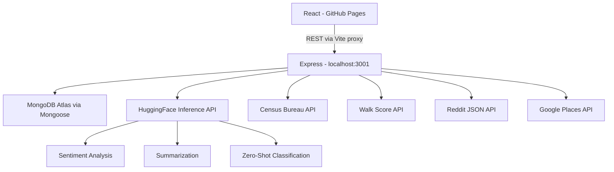

# NeighborLens 🏘️
AI-powered neighborhood intelligence for smarter relocation decisions.

## Live Demo
https://kavyasridhar1501.github.io/neighborlens
(Note: frontend only on GitHub Pages — run backend locally to use the full app)

## Tech Stack
| Layer      | Technology                              |
|------------|-----------------------------------------|
| Frontend   | React 18 · TypeScript · Tailwind · Recharts |
| Backend    | Node.js · Express · TypeScript · Zod    |
| Database   | MongoDB Atlas · Mongoose                |
| ML         | HuggingFace Inference API               |
| Frontend host | GitHub Pages                         |
| Backend    | Runs locally                            |

## Architecture


## Local Setup

### Prerequisites
- Node.js 18+
- MongoDB Atlas free account
- API keys: HuggingFace, Walk Score, Google Places

### Steps
```bash
# 1. Clone the repo
git clone https://github.com/kavyasridhar1501/neighborlens.git
cd neighborlens

# 2. Install all dependencies
npm run install:all

# 3. Set up environment variables
cp server/.env.example server/.env
# Edit server/.env and fill in your API keys

# 4. Run frontend + backend together
npm run dev
# Frontend → http://localhost:5173
# Backend  → http://localhost:3001
```

## GitHub Pages Setup (one time)
1. Go to repo Settings → Pages → Source → gh-pages branch
2. Go to Settings → Secrets → Actions and add:
   `VITE_API_BASE_URL=<your backend URL when hosted>`
3. Push to main — GitHub Actions deploys automatically

## API Endpoints
| Method | Path                        | Description                    |
|--------|-----------------------------|--------------------------------|
| GET    | /health                     | Health check                   |
| GET    | /api/neighborhood/:query    | Fetch neighborhood intelligence|
| GET    | /api/saved                  | List saved comparisons         |
| POST   | /api/saved                  | Save a comparison              |
| DELETE | /api/saved/:id              | Delete a comparison            |

## ML Models
| Task                  | Model                                      |
|-----------------------|--------------------------------------------|
| Sentiment analysis    | cardiffnlp/twitter-roberta-base-sentiment  |
| Vibe summarization    | facebook/bart-large-cnn                    |
| Lifestyle tag classification | facebook/bart-large-mnli            |

## Future Improvements
- Add Clerk auth so saved comparisons persist per user
- School district ratings via GreatSchools API
- Crime statistics integration
- Interactive Mapbox neighborhood overlays
- Natural language search
- Host backend so full app works from GitHub Pages link
